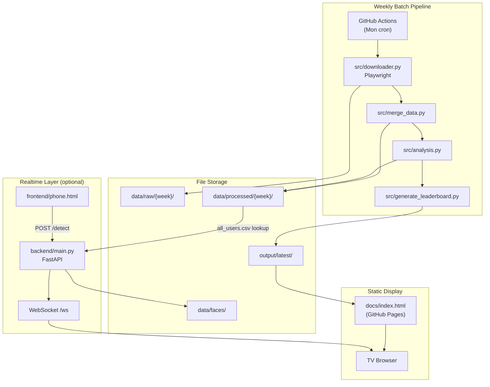
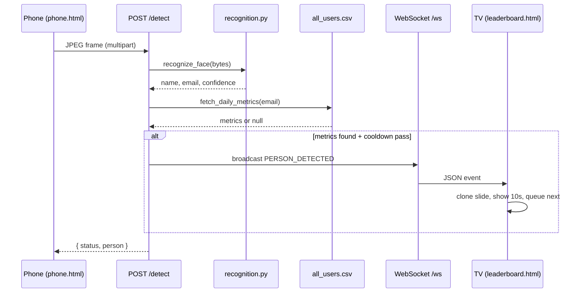
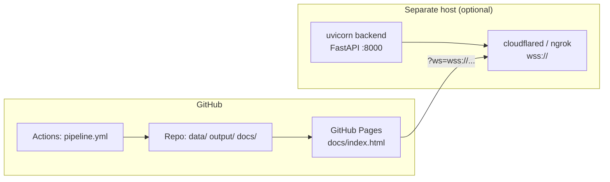

# System Architecture

This document describes how the **cursor-leaderboard** project is structured: the weekly batch pipeline, static TV display, and optional realtime face-detection overlay.

## Overview

The project is **not a traditional monolithic web application**. It combines three independent layers:

| Layer | Purpose | Technology |
|-------|---------|------------|
| **Batch pipeline** | Fetch Cursor usage data, score users, generate HTML | Python 3.11, pandas, Playwright, requests |
| **Static TV UI** | Full-screen weekly Top-10 slideshow | Vanilla HTML/CSS/JS (generated, no build step) |
| **Realtime overlay** | Phone camera → face ID → live card on TV | FastAPI, uvicorn, WebSockets, `face_recognition` |

**Persistence:** CSV files on disk. There is **no database** and **no ORM**.

**Deployment:** GitHub Actions (weekly cron) commits artifacts; the TV page is served via **GitHub Pages** (`docs/index.html`). The FastAPI backend is **not deployed by this repo** — it runs separately when live detection is needed.

---

## High-Level Diagram



---

## Repository Layout

```
cursor_leaderboard/
├── .github/workflows/pipeline.yml   # Weekly CI automation
├── backend/                         # FastAPI realtime service
│   ├── main.py                      # Routes, WebSocket, cooldown
│   ├── recognition.py               # face_recognition / dlib
│   ├── activity_client.py           # CSV metrics lookup
│   └── week_utils.py                # Date/week path helpers
├── src/                             # Batch pipeline
│   ├── pipeline.py                  # Orchestrator
│   ├── downloader.py                # Cursor dashboard scrape
│   ├── merge_data.py                # CSV joins
│   ├── analysis.py                  # Scoring + external API
│   ├── generate_leaderboard.py      # HTML generator + live overlay JS
│   └── utils.py                     # Directory helpers
├── frontend/
│   └── phone.html                   # Camera capture page
├── data/
│   ├── raw/                         # Downloaded CSVs
│   ├── processed/                   # Merged + scored CSVs
│   └── faces/                       # Reference photos for recognition
├── output/
│   ├── latest/leaderboard.html      # Current TV page
│   └── history/                     # Weekly snapshots
├── docs/
│   ├── index.html                   # GitHub Pages copy of leaderboard
│   └── *.md                         # Documentation
├── download_faces.py                # York Hub profile photo sync
└── daily_job.sh                     # Local cron wrapper (pipeline + faces)
```

---

## Layer 1: Weekly Batch Pipeline

### Flow

1. **Download** (`src/downloader.py`) — Playwright opens `cursor.sh/dashboard` using saved session state (`state_fixed.json`), navigates Analytics/Usage, sets last Mon–Fri date range, downloads `leaderboard.csv` and `usage.csv` into `data/raw/{week}/`.

2. **Merge** (`src/merge_data.py`) — Joins `employee_list.csv`, Cursor leaderboard, and team usage on email → `data/processed/{week}/merged.csv`.

3. **Analysis** (`src/analysis.py`) — Aggregates usage metrics, fetches prompt quality from the Daily Activity API, computes `usage_score`, `quality_norm`, and `final_score`. Writes `top10.csv` and `all_users.csv`.

4. **Generate** (`src/generate_leaderboard.py`) — Reads `top10.csv`, builds a self-contained HTML file with embedded CSS, slideshow JS, and WebSocket live-overlay JS. Writes `output/latest/leaderboard.html` and `output/history/{week}.html`.

5. **Publish** (GitHub Action) — Copies `output/latest/leaderboard.html` → `docs/index.html` and commits `data/`, `output/`, `logs/`, `docs/`.

See [data-pipeline.md](./data-pipeline.md) for step-by-step detail.

### Triggers

| Trigger | Entry point |
|---------|-------------|
| GitHub Actions (Mon 10:00 UTC) | `python src/pipeline.py` |
| Manual workflow dispatch | Same |
| Local cron / manual | `./daily_job.sh` (also runs `download_faces.py`) |

---

## Layer 2: Static TV Display

### Characteristics

- **Single HTML file** — no React, no bundler, no npm.
- **Auto-refresh** — `<meta http-equiv="refresh" content="300"/>` reloads every 5 minutes.
- **Slideshow** — Top-10 cards rotate every 6 seconds with progress bar and keyboard navigation.
- **Fonts** — Google Fonts CDN (Bebas Neue, Plus Jakarta Sans).

### Canonical files

| File | Use |
|------|-----|
| `output/latest/leaderboard.html` | Local TV / LAN testing |
| `docs/index.html` | GitHub Pages (HTTPS) |
| `output/history/{week}.html` | Weekly archive |

> **Note:** Root `leaderboard.html` is a legacy snapshot without the live WebSocket overlay. Always use `output/latest/` or `docs/index.html` for live detection.

---

## Layer 3: Realtime Face-Detection Overlay

### Flow



### Components

| Component | File | Role |
|-----------|------|------|
| Phone UI | `frontend/phone.html` | Camera capture, frame POST |
| API server | `backend/main.py` | REST + WebSocket + static files |
| Face ML | `backend/recognition.py` | dlib HOG encoding + matching |
| Metrics | `backend/activity_client.py` | Email → CSV row (in-memory index) |
| TV overlay | Inline JS in `generate_leaderboard.py` | WS client, slide clone, queue |

See [face-detection.md](./face-detection.md) and [api-reference.md](./api-reference.md) for protocol detail.

### State model

All realtime state is **in-memory** in a single uvicorn process:

- WebSocket connection set (`ConnectionManager`)
- Per-email broadcast cooldown (`Cooldown`, default 10s)
- Known-face encodings (loaded once at startup)
- CSV metrics index (mtime-cached)

Do not run multiple backend instances behind a load balancer without a shared store.

---

## External Integrations

| Service | Endpoint | Used by |
|---------|----------|---------|
| Cursor dashboard | `https://cursor.sh/dashboard` | `src/downloader.py` |
| York Hub | `https://api.hub.york.ie/api/external/...` | `generate_leaderboard.py`, `download_faces.py` |
| Daily Activity API | `https://prompts.yorkdevs.link/api/v1/users/daily-activity` | `src/analysis.py` |

Authentication is **API-key based** for external services only. The FastAPI layer has **no end-user auth** (CORS open by default in v1).

---

## Scoring Model (Summary)

`src/analysis.py` computes per-user scores from merged usage data plus prompt quality:

- **Usage score** — weighted blend of normalized AI lines, active days, tokens, non-auto model usage, credit utilization.
- **Quality score** — prompt-weighted average from Daily Activity API.
- **Final score** — 50% usage + 50% quality (both scaled 0–100).
- **Eligibility** — users must meet minimum AI lines (50th percentile) and prompt count (≥20) to appear in Top 10; all users are written to `all_users.csv` for live overlay lookup.

---

## Deployment Topology



| Component | Where it runs |
|-----------|---------------|
| Weekly pipeline | GitHub Actions `ubuntu-latest`, Python 3.11 |
| Static leaderboard | GitHub Pages (HTTPS) |
| Realtime backend | Local LAN, tunnel, or external PaaS (not in repo) |

---

## Security Considerations

- **Secrets** — `HUB_API_KEY`, `DAILY_ACTIVITY_API_KEY`, `CURSOR_STATE`, `EXTERNAL_API_SECRET` must never be committed. Use GitHub Secrets or local `.env` (gitignored).
- **FastAPI v1** — No auth on `/detect` or `/ws`; tighten via `ALLOWED_ORIGINS` and a reverse-proxy auth layer for production.
- **Static file route** — `GET /{file_path:path}` restricts extensions and resolves paths under allowed base directories only.
- **Face images** — `GET /faces/{filename}` accepts basename only (path traversal blocked).

---

## Performance Optimizations

| Optimization | Location |
|--------------|----------|
| Face encodings loaded once at startup | `backend/main.py` lifespan |
| Vectorized face distance (`np.stack`) | `backend/recognition.py` |
| CPU work off asyncio event loop | `asyncio.to_thread(recognize_face, ...)` |
| CSV index cached by file mtime | `backend/activity_client.py` |
| Phone frames downscaled to 640px | `frontend/phone.html` |
| Per-person cooldown + client dedupe | Backend + TV inline JS |
| WS reconnect with exponential backoff | TV inline JS |

---

## Related Documentation

| Document | Contents |
|----------|----------|
| [data-pipeline.md](./data-pipeline.md) | Batch ETL steps, file formats, week folders |
| [configuration.md](./configuration.md) | Environment variables and GitHub Secrets |
| [getting-started.md](./getting-started.md) | Local setup and run instructions |
| [api-reference.md](./api-reference.md) | FastAPI routes and WebSocket messages |
| [face-detection.md](./face-detection.md) | Live overlay design, browser compatibility |
| [../backend/README.md](../backend/README.md) | Backend quick start and HTTPS setup |
