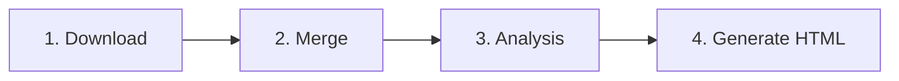

# Data Pipeline

The weekly batch pipeline transforms raw Cursor usage exports into scored CSVs and a static HTML leaderboard. It is orchestrated by `src/pipeline.py`.

## Pipeline Steps



```python
# src/pipeline.py
run_download()    # Step 1
run_merge()       # Step 2
run_analysis()    # Step 3
generate()        # Step 4 (generate_leaderboard.main)
```

---

## Week Folder Convention

All pipeline modules use the same **last complete Mon–Fri work week**:

```python
# Shared logic across downloader, merge_data, analysis, generate_leaderboard
last_monday = today - timedelta(days=today.weekday() + 7)
last_friday = last_monday + timedelta(days=4)
week_folder = f"{last_monday}_{last_friday}"  # e.g. 2026-05-25_2026-05-29
```

Files for that week live under:

- `data/raw/{week_folder}/`
- `data/processed/{week_folder}/`

---

## Step 1: Download

**Module:** `src/downloader.py`  
**Function:** `run_download()`

### What it does

1. Launches headless Chromium via Playwright.
2. Loads Cursor session from `state_fixed.json` (Playwright `storage_state`).
3. Opens `https://cursor.sh/dashboard` → Analytics tab.
4. Sets date range to last Mon–Fri using the dashboard date picker.
5. Downloads **Usage Leaderboard CSV** (5th "Download CSV" button) → `leaderboard.csv`.
6. Switches to Usage tab, sets same date range, exports → `usage.csv`.

### Outputs

| File | Description |
|------|-------------|
| `data/raw/{week}/leaderboard.csv` | Cursor usage leaderboard export |
| `data/raw/{week}/usage.csv` | Team usage export |

### Prerequisites

- `state_fixed.json` at repo root (in CI: decoded from `CURSOR_STATE` GitHub Secret).
- `pip install -r requirements.txt && playwright install`

---

## Step 2: Merge

**Module:** `src/merge_data.py`  
**Function:** `run_merge()`

### Inputs

| File | Source |
|------|--------|
| `data/raw/employee_list.csv` | Static employee roster |
| `data/raw/{week}/usage.csv` | Step 1 |
| `data/raw/{week}/leaderboard.csv` | Step 1 |

### Logic

1. Normalize all email columns to lowercase.
2. Drop redundant `Date`/`Name` columns from Cursor exports.
3. Left-join: `employee → cursor_leaderboard → team_usage` on `Email`.
4. Preserve column order: employee fields, then cursor fields, then usage fields.

### Output

| File | Description |
|------|-------------|
| `data/processed/{week}/merged.csv` | Full joined dataset |

---

## Step 3: Analysis

**Module:** `src/analysis.py`  
**Function:** `run_analysis()`

### External API

Fetches prompt quality data from the Daily Activity API:

```
POST https://prompts.yorkdevs.link/api/v1/users/daily-activity
Headers: x-api-key: $DAILY_ACTIVITY_API_KEY
Body: { "startDate": "...", "endDate": "..." }
```

Aggregates per email: `total_prompts`, `quality_score` (prompt-weighted average).

### Usage metrics (from merged.csv)

Per-user aggregation:

| Metric | Calculation |
|--------|-------------|
| `Active_Days` | Unique dates with activity |
| `Total_AI_Lines` | Max AI lines in period |
| `Total_Tokens` | Sum of tokens |
| `Total_Cost` | Sum of cost |
| `Total_Prompts` | Row count |
| `Non_Auto_Percentage` | Share of non-`auto` model usage |

### Scoring

**Usage score** (0–1, then ×100):

```
0.60 × AI_norm + 0.10 × Active_norm + 0.10 × Token_norm
+ 0.10 × Model_norm + 0.10 × Credit_norm
```

**Final score:**

```
final_score = 0.5 × usage_score + 0.5 × quality_norm  (scaled 0–100)
```

### Eligibility for Top 10

Users must meet:

- `Total_AI_Lines` ≥ 50th percentile of cohort
- `Total_Prompts` ≥ 20

Eligible users are ranked by `final_score`; remaining users follow in `all_users.csv`.

### Outputs

| File | Description |
|------|-------------|
| `data/processed/{week}/top10.csv` | Top 10 eligible users (HTML input) |
| `data/processed/{week}/all_users.csv` | All users ranked (live overlay metrics source) |

---

## Step 4: Generate HTML

**Module:** `src/generate_leaderboard.py`  
**Function:** `main()`

### Input

`data/processed/{week}/top10.csv` — sorted by `final_score`, top 10 rows tagged with `_rank`.

### Output

| File | Purpose |
|------|---------|
| `output/latest/leaderboard.html` | Current TV display |
| `output/history/{week}.html` | Weekly archive |

### Generated page features

- Embedded CSS (no external stylesheet except Google Fonts).
- Slideshow IIFE: 6s per slide, dots, progress bar, keyboard nav.
- Live overlay IIFE: WebSocket client, slide cloning, 10s hold, FIFO queue.
- Auto-refresh meta tag: 300 seconds.

Avatar paths in weekly slides use `/faces/{name-slug}_{email}.png` (served by FastAPI when backend runs).

---

## Face Photo Sync (Optional)

**Script:** `download_faces.py`  
**Not part of `pipeline.py`** — run separately or via `daily_job.sh`.

1. Calls `GET https://api.hub.york.ie/api/external/users/active` with `EXTERNAL_API_SECRET`.
2. Downloads each user's `profile_image` into `data/faces/`.
3. Filename convention: `{normalized-name}_{email}.{ext}`.

Restart uvicorn after downloading so `recognition.py` reloads encodings.

---

## CI Automation

**Workflow:** `.github/workflows/pipeline.yml`

| Setting | Value |
|---------|-------|
| Schedule | `0 10 * * 1` (Monday 10:00 UTC) |
| Python | 3.11 |
| Secrets | `HUB_API_KEY`, `DAILY_ACTIVITY_API_KEY`, `CURSOR_STATE` |
| Post-run | `cp output/latest/leaderboard.html docs/index.html` |
| Commit | `data/`, `output/`, `logs/`, `docs/` |

---

## Local Execution

```bash
# Minimal pipeline (requires env vars + state_fixed.json)
export HUB_API_KEY=...
export DAILY_ACTIVITY_API_KEY=...
python src/pipeline.py

# Full local job (pipeline + face download)
./daily_job.sh   # reads .env, writes logs/YYYY-MM-DD.log
```

Logs: `logs/pipeline.log` (from pipeline) and `logs/YYYY-MM-DD.log` (from daily_job.sh).

---

## Data Directory Reference

```
data/
├── raw/
│   ├── employee_list.csv          # Static roster
│   └── {YYYY-MM-DD}_{YYYY-MM-DD}/
│       ├── usage.csv
│       └── leaderboard.csv
├── processed/
│   └── {YYYY-MM-DD}_{YYYY-MM-DD}/
│       ├── merged.csv
│       ├── top10.csv
│       └── all_users.csv
└── faces/
    └── {name}_{email}.png         # Face recognition references
```
