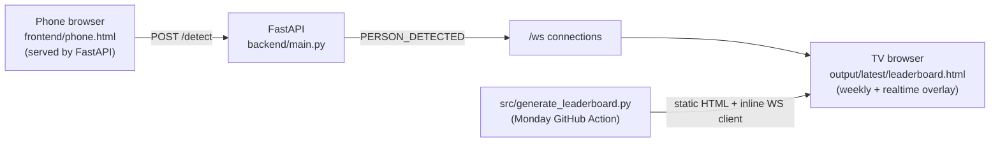
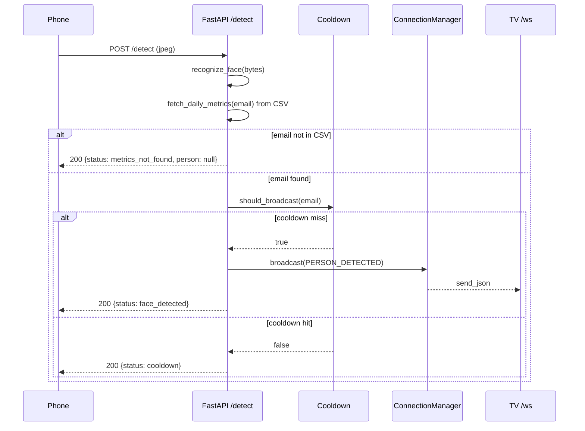

# Face Detection → TV Display Pipeline

> **See also:** [architecture.md](./architecture.md) · [api-reference.md](./api-reference.md) · [getting-started.md](./getting-started.md)

## Overview

Adds a real-time face-detection layer on top of the existing weekly Cursor leaderboard. A phone running `frontend/phone.html` auto-captures camera frames, posts them to a FastAPI backend, and the backend pushes detected-person events to every connected TV over a WebSocket. The TV is the same static leaderboard page that the weekly pipeline already generates — augmented with a small WebSocket client that injects a "LIVE" detection card into the existing slider for 10 seconds, then removes it.

No new framework. No database. No authentication. The weekly leaderboard rendering, slider rotation, GitHub Action, and GitHub Pages deployment continue to work exactly as before; the realtime layer is purely additive.

## Problem Statement

- The leaderboard HTML is a static, weekly-regenerated page served from GitHub Pages. It has no backend.
- Goal: light up the same TV when a known person walks past a phone-mounted camera, without altering how the weekly leaderboard is built or deployed.

## Solution



- **Backend** (`backend/main.py`): FastAPI app with `POST /detect`, `WS /ws`, `GET /phone`, `GET /health`. In-memory state. CORS open by default.
- **Phone** (`frontend/phone.html`): `getUserMedia` → canvas → JPEG → `POST /detect` every ~3 s (after 3 s face dwell). No buttons.
- **TV**: the existing leaderboard HTML with an **inline WebSocket script** emitted by `src/generate_leaderboard.py`. On `PERSON_DETECTED`, it clones a weekly slide, shows it for 10 s, and queues additional detections. The weekly carousel continues independently.

> See also [architecture.md](./architecture.md) and [api-reference.md](./api-reference.md).

## Technical Details

### Routes

| Method | Path      | Body / Notes                                                            | Response                                                                 |
| ------ | --------- | ----------------------------------------------------------------------- | ------------------------------------------------------------------------ |
| POST   | `/detect` | `multipart/form-data` field `image` **or** `application/json` `{image_b64}` | `{status: "face_detected"\|"cooldown"\|"no_face"\|"metrics_not_found", person: {...}\|null}` |
| WS     | `/ws`     | Server → client only. Initial `{"type":"HELLO"}` on connect.            | `{"type":"PERSON_DETECTED", "payload": {...}}`                          |
| GET    | `/phone`  | Serves `frontend/phone.html` from the same origin as the API.           | `text/html`                                                              |
| GET    | `/health` | Liveness probe.                                                         | `{"ok": true, "connections": N}`                                         |
| GET    | `/faces/{filename}` | Reference photo for TV overlay (basename only).                 | `image/jpeg` or `image/png`                                              |

### Message schema

```json
{
  "type": "PERSON_DETECTED",
  "payload": {
    "name": "Nilesh",
    "email": "nileshs@york.ie",
    "image": "nilesh_nileshs@york.ie.jpg",
    "metrics": {
      "totalAiLines": 573,
      "promptCount": 29,
      "avgScore": 5.86,
      "activeDays": 4,
      "usageScore": "-"
    }
  }
}
```

Cooldown and TV dedupe use **`email`**. Live metrics come from the pipeline CSV (`backend/activity_client.py` reads `data/processed/{week}/all_users.csv`) — no external API at runtime. If the matched email is not in the CSV, the backend returns `metrics_not_found` and does not broadcast.

### Sequence



### Cooldown

- Per-person window of `COOLDOWN_SECONDS` (default 10 s).
- Guarded by an `asyncio.Lock` so concurrent detections of the same id don't both pass through.
- Also enforced client-side on the TV via `activeIds` (email-based) for the duration of each 10 s live slide.

### TV overlay

The live overlay is **inlined in `src/generate_leaderboard.py`** as a second `<script>` IIFE (not a separate module). It:

1. Resolves the WebSocket URL at runtime (`?ws=` → `window.LEADERBOARD_WS_URL` → default `wss://cursor-leaderboard.yorkdevs.link/ws`).
2. Opens a WebSocket with exponential-backoff reconnect (1 s → 30 s cap).
3. On `PERSON_DETECTED`: dedupes by email, clones `.slide[data-rank]`, fills metrics, shows for 10 s, removes.
4. Queues up to **10** pending detections (FIFO) while a slide is visible.

The weekly slider IIFE is unchanged; live slides are appended as siblings and do not join the 6 s rotation.

### Face recognition

Real recognition backed by the [`face_recognition`](https://github.com/ageitgey/face_recognition) library (dlib under the hood). Lives in `[backend/recognition.py](../backend/recognition.py)` and has zero FastAPI imports — the route in `[backend/main.py](../backend/main.py)` offloads it via `asyncio.to_thread` so the event loop never blocks.

**Pipeline (per probe frame):**

1. Decode JPEG/PNG bytes to an RGB uint8 numpy array via Pillow.
2. `face_recognition.face_locations(img, model="hog")` — HOG detector (CPU). CNN switchable via `FACE_DETECT_MODEL=cnn` for GPU-built dlib.
3. `face_recognition.face_encodings(img, known_face_locations=locations[:1])` — first face only (spec).
4. `face_recognition.face_distance(known.encodings, probe)` — vectorised over the stacked `(N, 128)` reference encodings.
5. `face_recognition.compare_faces(known.encodings, probe, tolerance=THRESHOLD)` — threshold gate.
6. Best match index = `argmin(distances)`; accept iff `compare_faces[best_idx]` is `True`.
7. Return `{id, name, confidence}` where `confidence = round(max(0, min(1, 1 - distance)), 3)` — derived directly from the library's distance output, no invented curve.

**Threshold:** `FACE_MATCH_THRESHOLD` env (default `0.45` in `backend/main.py`; override as needed). Lower = stricter.

**Known-face roster:** loaded once at app startup from `data/faces/` (override via `FACES_DIR`).

- Filename convention: `<normalized-name>_<email>.<ext>` where `<ext>` ∈ `{jpg, jpeg, png}`. Everything after the first `_` is the email (must contain `@`). The name segment is lowercase with spaces as hyphens (e.g. `nilesh-sukhwani_nileshs@york.ie.jpg` → display name "Nilesh Sukhwani", email `nileshs@york.ie`).
- Bad filenames, zero-face images, and unreadable files are warned and skipped — never fatal.
- Multi-face reference photos: first encoding is used, a warning is emitted.
- Encodings are stacked into one `(N, 128)` numpy array at load time so per-probe distance is a single vectorised call.
- Empty roster + `REQUIRE_KNOWN_FACES=1` (the default) → uvicorn refuses to start. Set `REQUIRE_KNOWN_FACES=0` for dev / CI without reference photos.

**Refreshing the roster from York Hub**

Use the repo-root script [`download_faces.py`](../download_faces.py) to pull profile photos for all active employees:

```bash
export EXTERNAL_API_SECRET=your_hub_external_api_key
python download_faces.py
```

The script calls `GET https://api.hub.york.ie/api/external/users/active`, downloads each `profile_image` into `data/faces/`, and overwrites existing files for the same email. Users without a profile image or with unreachable URLs are skipped (batch continues). Restart uvicorn after a download so `recognition.py` reloads encodings.

If image URLs return 401/403 without auth, the script retries the download with the same `x-api-key` header. Add `--verbose` for debug logs (URLs truncated).

**Architecture:**

- Pure recognition seam: `recognition.py` imports only `face_recognition`, `numpy`, `PIL`, `pathlib`, `logging`, `re`. No FastAPI, no app state, no I/O beyond decoding the in-memory bytes.
- `KnownFaces` is read-only after load; safe to share across the asyncio thread pool with no lock.
- The route wraps the call in `await asyncio.to_thread(recognize_face, …)`. `face_recognition` releases the GIL during native dlib calls, so concurrent probes from multiple phones get real parallelism.

**Perf notes (HOG, CPU):**

- Phone uploads are pre-downsampled to 640 px longest edge by `frontend/phone.html`. On that input, a single recognition call is typically 80–200 ms on a modern laptop, 200–500 ms on slower devices. The capture loop is paced at 1.5 s so there's plenty of headroom.
- Startup encoding cost is ~50–150 ms per reference photo. For dozens of faces, expect a one-time second or so.

**To swap to InsightFace / a different model**, replace the body of `recognize_face` (and adapt `load_known_faces` to use the new encoder). Keep the input (`image_bytes`) and output (`{name, email, image_filename, confidence}`) shapes — no other file changes.

### Live metrics (CSV)

After a face match, `backend/activity_client.py` looks up the email in `all_users.csv` (default path: `data/processed/{start}_{end}/all_users.csv`, same rolling 7-day folder as `src/utils.get_week_folder()`). Fields are copied directly from the CSV — no runtime aggregation:

| Payload field | CSV column |
|---------------|------------|
| `metrics.totalAiLines` | `Total_AI_Lines` |
| `metrics.promptCount` | `Total_Prompts` (fallback `total_prompts`) |
| `metrics.avgScore` | `quality_score` |
| `metrics.activeDays` | `Active_Days` |
| `metrics.usageScore` | `usage_score` |
| `metrics.finalScore` | `final_score` |
| `metrics.rank` | computed at load (sort by `final_score` desc) |

Override the file with `ALL_USERS_CSV=/path/to/all_users.csv`. The weekly pipeline (`src/analysis.py`) still calls the Daily Activity API to **generate** this CSV; uvicorn does not need `DAILY_ACTIVITY_API_KEY`.

## Configuration

All env vars are optional; sensible defaults make `uvicorn` + a locally-opened leaderboard "just work".

| Env var                 | Default                  | Used by                       | Purpose                                                                                  |
| ----------------------- | ------------------------ | ----------------------------- | ---------------------------------------------------------------------------------------- |
| _(TV runtime)_          | `?ws=` query param       | Generated HTML                | WebSocket URL resolved at runtime, not build time. See [configuration.md](./configuration.md). |
| `COOLDOWN_SECONDS`      | `10`                     | `backend/main.py`             | Per-person broadcast suppression window.                                                 |
| `MAX_IMAGE_BYTES`       | `5242880` (5 MB)         | `backend/main.py`             | Hard cap on `/detect` payload size.                                                      |
| `ALLOWED_ORIGINS`       | `*`                      | `backend/main.py`             | Comma-separated CORS origins.                                                            |
| `LOG_LEVEL`             | `INFO`                   | `backend/main.py`             | stdlib logging level.                                                                    |
| `FACES_DIR`             | `data/faces`             | `backend/main.py`             | Directory scanned at startup for reference photos.                                       |
| `FACE_MATCH_THRESHOLD`  | `0.6`                    | `backend/main.py`             | Maximum face-distance to count as a match. Lower = stricter.                             |
| `FACE_DETECT_MODEL`     | `hog`                    | `backend/main.py`             | dlib face detector: `hog` (CPU) or `cnn` (GPU build of dlib).                            |
| `ALL_USERS_CSV`         | `data/processed/{week}/all_users.csv` | `backend/activity_client.py` | Precomputed metrics CSV for live detections. |
| `DAILY_ACTIVITY_API_KEY` | _(pipeline only)_       | `src/analysis.py`             | API key to build `all_users.csv` in CI; not required for uvicorn.                          |
| `REQUIRE_KNOWN_FACES`   | `1`                      | `backend/main.py`             | If truthy, refuse to start when the roster is empty. Set `0` for dev / CI without faces. |
| `EXTERNAL_API_SECRET`   | _(unset)_                | `download_faces.py`           | York Hub external API key for bulk roster download (not used by uvicorn at runtime). |

## Running locally

```bash
# 1. Backend
python3 -m venv .venv
.venv/bin/pip install -r backend/requirements.txt
.venv/bin/uvicorn main:app --reload --host 0.0.0.0 --port 8000 --app-dir backend

# 2. Phone — open in laptop browser (or same-LAN phone)
open http://localhost:8000/phone

# 3. TV — open the existing generated leaderboard
open output/latest/leaderboard.html
```

Open the TV with a WebSocket query parameter after regenerating:

```
output/latest/leaderboard.html?ws=wss://my-backend.example.com/ws
```

## Edge Cases

- **Same person within 10 s** → server suppresses (status `cooldown`), no broadcast. TV also dedupes client-side.
- **TV refresh** (5-min `<meta http-equiv="refresh">` in the leaderboard) → WS closes; auto-reconnect with exponential backoff brings it back within 1–2 s.
- **Backend down** → reconnect timer keeps trying; phone shows `Network error` on each capture; nothing else breaks.
- **Multiple detections in rapid succession** → queued FIFO, capped at 5. Overflow is logged and dropped.
- **Slow / dead TV** → broadcasts are best-effort per connection; a failed `send_json` removes that socket and never blocks other TVs.
- **Camera permission denied / non-HTTPS context / in-app browser / iOS autoplay rejection** → phone page renders one of 9 distinct, actionable error states. See [Browser compatibility](#browser-compatibility).
- **Empty / non-image / oversized payloads to `/detect`** → 400 with a descriptive `detail`.

## Browser compatibility

The phone page (`frontend/phone.html`) isolates all camera handling in a single `Camera` IIFE so a future native-app wrapper / WebView shim can swap the implementation without touching the rest of the page. The module classifies failures into one of nine codes and renders a tailored, actionable message for each.

| Code               | When it triggers                                                                                                         | What the user sees                                                                                       |
| ------------------ | ------------------------------------------------------------------------------------------------------------------------ | -------------------------------------------------------------------------------------------------------- |
| `INSECURE_CONTEXT` | `window.isSecureContext === false` and host is not `localhost` / `127.0.0.1`. **Browsers strip `navigator.mediaDevices` on plain HTTP from a LAN IP.** | "HTTPS required" + one-line `cloudflared` tunnel example.                                                |
| `IN_APP_BROWSER`   | UA matches FBAN / FBAV / Instagram / LINE / WeChat / LinkedInApp / Snapchat / TikTok / Pinterest / etc.                  | "Open in Safari/Chrome" with menu directions.                                                            |
| `NO_API`           | Even after the legacy polyfill, `navigator.mediaDevices.getUserMedia` is missing.                                        | "Use a recent version of Safari, Chrome, Edge, Samsung Internet, or Firefox."                            |
| `PERMISSION`       | `getUserMedia` rejected with `NotAllowedError` / `SecurityError`.                                                        | iOS + Android-specific settings paths to re-enable.                                                      |
| `NO_CAMERA`        | `NotFoundError`.                                                                                                         | "No camera found on this device."                                                                        |
| `CAMERA_BUSY`      | `NotReadableError` / `TrackStartError`.                                                                                  | "Close the app that has the camera open and reload."                                                     |
| `OVERCONSTRAINED`  | All three rungs of the constraint ladder rejected with `OverconstrainedError`.                                           | "No camera matched the requested settings."                                                              |
| `NEEDS_GESTURE`    | `getUserMedia` succeeded but `<video>.play()` rejected (iOS autoplay rule).                                              | Pulsing "Tap to start camera" overlay; tap → `play()` retried inside the gesture handler → capture loop. |
| `UNKNOWN`          | Anything else (e.g. `AbortError`).                                                                                       | "Could not start the camera. Try reloading."                                                             |

### What the page does to maximize compatibility

1. **Diagnose before launching.** `Camera.diagnose()` short-circuits with `INSECURE_CONTEXT` / `IN_APP_BROWSER` / `NO_API` before ever calling `getUserMedia`, so the error message is precise.
2. **Legacy polyfill.** If only `navigator.getUserMedia` / `webkitGetUserMedia` / `mozGetUserMedia` / `msGetUserMedia` is present, it's wrapped into a Promise-based `mediaDevices.getUserMedia` shim.
3. **Constraint fallback ladder.** Tries `facingMode: user` (HD), then `facingMode: environment`, then `video: true`. Only `OverconstrainedError` falls through; permission/no-camera errors abort immediately.
4. **`<video>` attributes.** `autoplay muted playsinline webkit-playsinline` — covers Safari iOS, Android Chrome, Samsung Internet, Edge, Firefox.
5. **Mirror only the front camera.** If the ladder selects the rear camera, the `no-mirror` class drops the `scaleX(-1)` so text in the scene is readable.
6. **Tap-to-start fallback.** On iOS Safari's rare autoplay rejection, a one-time full-screen gesture catcher (not a button — no controls, just a tap target) calls `play()` inside the real user-gesture handler.
7. **No alerts, no reloads, no crashes.** Every failure surfaces in the inline `#error` panel with a title + body. Recoverable states (permission, busy camera) tell the user exactly which setting to change and to reload manually.

### Required deployment: HTTPS for any non-localhost phone

`getUserMedia` is **only** available in a secure context. Modern browsers deliberately remove `navigator.mediaDevices` on plain HTTP from a LAN address — no JS workaround exists. For LAN testing on a real phone:

```bash
# Option A: quick HTTPS tunnel (recommended for testing)
cloudflared tunnel --url http://localhost:8000
# or:  ngrok http 8000

# Option B: locally trusted HTTPS cert
brew install mkcert nss
mkcert -install
mkcert localhost 127.0.0.1 my-laptop.local
uvicorn main:app --app-dir backend --host 0.0.0.0 --port 8000 \
  --ssl-certfile ./localhost+2.pem --ssl-keyfile ./localhost+2-key.pem
```

When you switch to HTTPS, rebuild the leaderboard with `BACKEND_WS_URL` set to `wss://…/ws` so the TV connects over the secure WebSocket.

## Risks & Mitigations

| Risk | Mitigation |
| ---- | ---------- |
| GitHub Pages can't host the FastAPI backend. | Backend hosting is intentionally out of scope; URL is configurable so any host works. Local `uvicorn` is the documented default. |
| iOS browsers block `getUserMedia` on plain HTTP except `localhost`. | Documented; recommend `cloudflared` / `ngrok` / self-signed cert for LAN phone testing. |
| WebSocket URL must be configured per deployment. | Resolved at runtime via `?ws=` or `window.LEADERBOARD_WS_URL`; default fallback in generated HTML. |
| In-memory cooldown / connections don't span processes. | Single-process deploy in v1. `ConnectionManager` interface is unchanged for a future Redis-backed swap. |
| CORS `*` and no auth. | Per spec for v1. Tighten via `ALLOWED_ORIGINS` and an upstream auth proxy for production. |

## Rollout

- **v1 (this change)**: local backend, mock recognition. Weekly leaderboard generation unchanged on disk except for an additional `<style>` block and a final `<script>` block. Existing TV displays continue to show the rotating Top-10 with no visible difference until a detection arrives.
- **Backward compatibility**: If the backend is not running, the TV silently retries the WebSocket and the weekly slideshow rotates as before.
- **Migration**: none required. Pass `?ws=wss://…` on the TV URL when deploying a public backend.

## How to swap mock recognition for real ML

1. Add the ML dependency (e.g. `insightface`, `opencv-python`) to `backend/requirements.txt`.
2. Replace the body of `recognize_face` in `backend/recognition.py`. Keep the input/output contract documented in [api-reference.md](./api-reference.md).
3. Return `None` when no face is found / no identity matches — `/detect` will then respond with `status: "no_face"` and skip broadcast.
4. Add unit tests around the new recognizer; the rest of the pipeline does not need changes.

## File map

- `backend/main.py` — FastAPI app, routes, ConnectionManager, cooldown, lifespan.
- `backend/recognition.py` — face match + email-based filename parsing.
- `backend/week_utils.py` — `get_week()` / `get_pipeline_week_folder()` rolling 7-day date range (delegates to `src/utils.py`).
- `backend/activity_client.py` — CSV metrics lookup (no runtime API calls).
- `backend/requirements.txt` — FastAPI / uvicorn / face_recognition.
- `frontend/phone.html` — vanilla-JS auto-capture page.
- `src/generate_leaderboard.py` — HTML generator with inlined slideshow + live overlay scripts.

## TV overlay implementation

The live overlay is emitted by `src/generate_leaderboard.py` into every generated leaderboard. It clones an existing `.slide[data-rank]` frame and fills it with detection data. **No custom layout CSS** — live cards use the same classes as Top-10 slides (`person-section`, `stats-grid`, `active-days`, etc.).

### UI: clone-and-fill (same frame as weekly slides)

On `PERSON_DETECTED`, the script:

1. Deep-clones the first weekly slide (`.slide[data-rank]`) as a structural prototype.
2. Clears `.dots-row` (avoids duplicate dot ids).
3. Fills fields via existing selectors only:

| Region | Selector | Live value |
|--------|----------|------------|
| Rank | `.rank-num` | `—` (no ordinal) |
| Avatar | `.avatar-img` or `.avatar-placeholder` | `GET /faces/{image}` from WS host |
| Name | `.person-name` | Uppercased `name` |
| Subtitle | `.person-title` | `email` |
| Total AI Lines | USAGE column, 1st `strong` | `metrics.totalAiLines` |
| Usage score | USAGE column, 2nd `strong` | `metrics.usageScore` (often `"-"`) |
| Total Prompts | QUALITY column, 1st `strong` | `metrics.promptCount` |
| Quality score | QUALITY column, 2nd `strong` | `metrics.avgScore` |
| Active days | `.active-days strong` | `metrics.activeDays` |
| Final score | `.final-score-bar strong` | `-` (no pipeline composite) |

Rank/avatar accent color uses `#64748b` (same as rank 4+ in the generator).

### Behaviour

- Listens on a WebSocket and reacts to `PERSON_DETECTED` events (same payload
  contract as `backend/main.py` broadcasts).
- Appends a normal `.slide` to `#slideshow`, adds `.active`, removes after **10 s**
  via `.exit` (~700 ms) — same transitions as the weekly carousel.
- The weekly slider IIFE is **not** modified; its `slides[]` snapshot is taken at
  boot, so live slides do not join the 6 s rotation (they stack as later siblings).
- Each live slide stays visible for **10 s**, then is removed from the DOM.
- **Frontend dedupe**: detections with a `payload.email` currently being shown are
  silently dropped. The email is released when the slide's 10 s lifetime ends.
  This is in addition to the backend's per-email `Cooldown`.
- **Queue**: if multiple distinct people arrive while one is on screen, they
  are queued FIFO and shown sequentially as the current slide retires.
  Soft-capped at 10 to bound memory under runaway bursts; new arrivals beyond
  the cap are dropped.
- **Reconnect**: exponential backoff 1 s → 30 s (doubling), reset on every
  successful `onopen`. No console noise on the hot path; malformed messages
  are silently ignored.

### WebSocket URL resolution

The inline overlay does not bake a URL at build time. At runtime it resolves
the WS endpoint in priority order:

1. `?ws=` query parameter on the page URL —
   `leaderboard.html?ws=ws://192.168.1.42:8000/ws`
2. `window.LEADERBOARD_WS_URL` global (settable from another script tag, a
   bookmarklet, or DevTools).
3. Fallback default: `wss://cursor-leaderboard.yorkdevs.link/ws`.

The TV is expected to be opened with the `?ws=` query param pointing at the
LAN (or `wss://` tunnel) backend.

### Mixed-content note (GitHub Pages)

GitHub Pages serves `docs/index.html` over HTTPS. Most browsers will block a
plain `ws://` from an HTTPS page as mixed content. For a TV opening the
GitHub Pages URL, the backend must be reachable via `wss://` — terminate TLS
with a tunnel such as `cloudflared` (same constraint already documented for
the phone in the Browser compatibility section) and pass
`?ws=wss://your-tunnel.example/ws`. Opening
`output/latest/leaderboard.html` from `file://` or a local plain-HTTP server
allows `ws://` without the mixed-content restriction.

### Troubleshooting (live slide never appears)

| Symptom | Likely cause | Fix |
|---------|--------------|-----|
| Backend logs `broadcast delivered=1/1` but TV shows nothing | Wrong HTML file | Open **`output/latest/leaderboard.html`** or **`docs/index.html`**, not root `leaderboard.html` (no WebSocket overlay). |
| WS connected, first detect works, same person never again until reload | Old dedupe bug (fixed): `activeIds` was set before a successful build | Hard-refresh after updating; or append `?live_debug=1` and check console for `[live] buildLiveSlide failed`. |
| WS never connects from phone tunnel | TV still on `ws://localhost:8000/ws` | Pass `?ws=wss://<your-tunnel>/ws` on the TV URL (same host as `/phone`). |
| Slide in DOM but invisible | Clone inherited `exit` / missing `active` | Fixed: clones strip `active`/`exit` before fill; verify element has class `slide active`. |

Enable verbose client tracing without changing code: open the TV page with
`?live_debug=1` (can combine with `?ws=…`). Logs `PERSON_DETECTED`, build
success/failure, and slide lifecycle in the browser console.

### Validation

- Open the file with no backend: page renders normally, slider rotates, no
  console errors apart from the silent reconnect ladder.
- Boot backend, open with `?ws=ws://localhost:8000/ws`, `POST /detect` the
  reference photo: live slide matches weekly card layout, holds 10 s, fades out.
- Inspect DOM: live node is `.slide` only (no `live-detection` or `.live-*` classes).
- Re-POST the same person inside 10 s: backend cooldown suppresses; if a raw
  duplicate `PERSON_DETECTED` is forced over the WS, the frontend `Set` drops
  it.
- POST two different people back-to-back: first slide plays for 10 s, second
  is dequeued and plays for its own 10 s; no overlap.
- Kill backend mid-session: in-flight slide finishes naturally, reconnect
  ladder runs; restart resumes detection.
- Send invalid JSON / missing payload: silently dropped.

### Generated artifacts

- `output/latest/leaderboard.html` — current TV page with live overlay script.
- `docs/index.html` — copy deployed to GitHub Pages (updated by CI each Monday).
- Root `leaderboard.html` — legacy snapshot **without** live overlay; do not use for detection testing.
