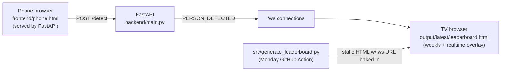
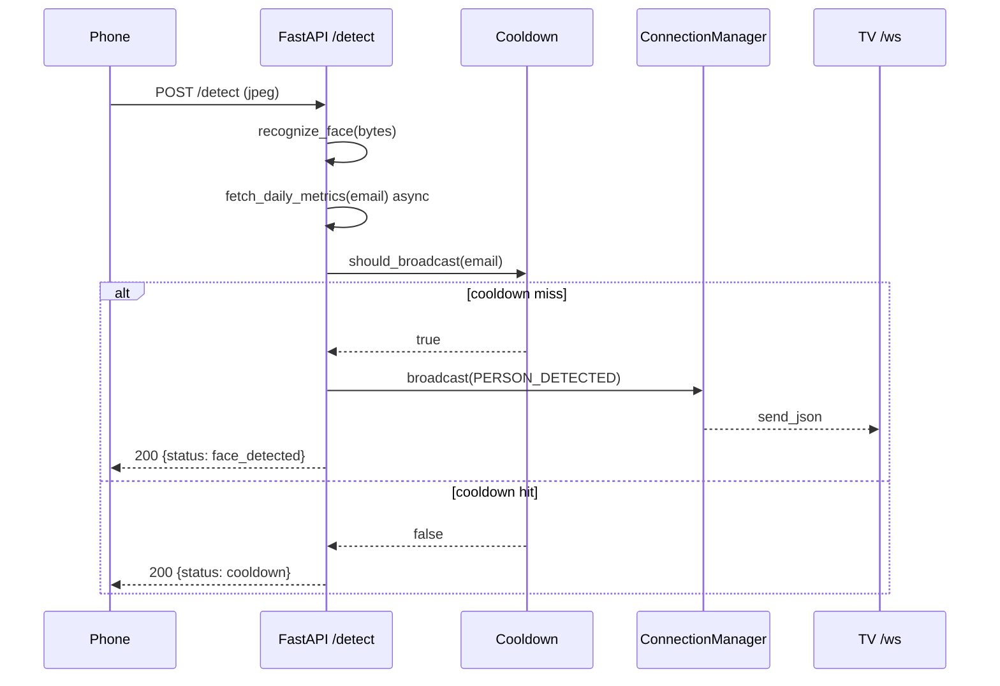

# Face Detection → TV Display Pipeline

## Overview

Adds a real-time face-detection layer on top of the existing weekly Cursor leaderboard. A phone running `frontend/phone.html` auto-captures camera frames, posts them to a FastAPI backend, and the backend pushes detected-person events to every connected TV over a WebSocket. The TV is the same static leaderboard page that the weekly pipeline already generates — augmented with a small WebSocket client that injects a "LIVE" detection card into the existing slider for 10 seconds, then removes it.

No new framework. No database. No authentication. The weekly leaderboard rendering, slider rotation, GitHub Action, and GitHub Pages deployment continue to work exactly as before; the realtime layer is purely additive.

## Problem Statement

- The leaderboard HTML is a static, weekly-regenerated page served from GitHub Pages. It has no backend.
- Goal: light up the same TV when a known person walks past a phone-mounted camera, without altering how the weekly leaderboard is built or deployed.

## Solution



- **Backend** (`backend/main.py`): FastAPI app with `POST /detect`, `WS /ws`, `GET /phone`, `GET /health`. In-memory state. CORS open by default.
- **Phone** (`frontend/phone.html`): `getUserMedia` → canvas → JPEG → `POST /detect` every 1.5 s. No buttons.
- **TV**: the existing leaderboard HTML, augmented by `src/tv_realtime.py`. A WebSocket client inside the page listens for `PERSON_DETECTED`, builds a live `.slide`, pauses the rotation for 10 s, then resumes.

## Technical Details

### Routes

| Method | Path      | Body / Notes                                                            | Response                                                                 |
| ------ | --------- | ----------------------------------------------------------------------- | ------------------------------------------------------------------------ |
| POST   | `/detect` | `multipart/form-data` field `image` **or** `application/json` `{image_b64}` | `{status: "face_detected"\|"cooldown"\|"no_face", person: {...}\|null}` |
| WS     | `/ws`     | Server → client only. Initial `{"type":"HELLO"}` on connect.            | `{"type":"PERSON_DETECTED", "payload": {...}}`                          |
| GET    | `/phone`  | Serves `frontend/phone.html` from the same origin as the API.           | `text/html`                                                              |
| GET    | `/health` | Liveness probe.                                                         | `{"ok": true, "connections": N}`                                         |
| GET    | `/faces/{filename}` | Reference photo for TV overlay (basename only).                 | `image/jpeg` or `image/png`                                              |

### Message schema

```json
{
  "type": "PERSON_DETECTED",
  "payload": {
    "name": "Nilesh",
    "email": "nileshs@york.ie",
    "image": "nilesh_nileshs@york.ie.jpg",
    "metrics": {
      "totalAiLines": 573,
      "promptCount": 29,
      "avgScore": 5.86,
      "activeDays": 4,
      "usageScore": "-"
    }
  }
}
```

Cooldown and TV dedupe use **`email`**. Metrics come from the York daily-activity API (`backend/activity_client.py`) for a **rolling 7-day window ending today**. If the API fails or the key is unset, the face match still broadcasts with `"-"` placeholders (partial failure).

### Sequence



### Cooldown

- Per-person window of `COOLDOWN_SECONDS` (default 10 s).
- Guarded by an `asyncio.Lock` so concurrent detections of the same id don't both pass through.
- Also enforced client-side on the TV (`DEDUP_MS = 10000` in `src/tv_realtime.py`) — covers backend restarts that would otherwise reset the cooldown map.

### TV overlay

- `src/tv_realtime.py` exposes `get_realtime_styles()` and `get_realtime_script(ws_url)`. Both are interpolated into the generator's f-string in `src/generate_leaderboard.py`.
- The existing slider IIFE now publishes `window.__leaderboard = { pause, resume }`. The realtime script:
  1. waits for `window.__leaderboard`,
  2. opens a WebSocket with exponential-backoff reconnects (base 1 s, cap 30 s),
  3. on `PERSON_DETECTED`: dedupes per id within 10 s; otherwise calls `pause()`, appends a new `.slide.live-detection`, activates it, drives the progress bar for 10 s, then removes it and `resume()`s.
- A short FIFO queue (max 5) absorbs bursts that arrive while a card is on screen.

### Face recognition

Real recognition backed by the [`face_recognition`](https://github.com/ageitgey/face_recognition) library (dlib under the hood). Lives in `[backend/recognition.py](../backend/recognition.py)` and has zero FastAPI imports — the route in `[backend/main.py](../backend/main.py)` offloads it via `asyncio.to_thread` so the event loop never blocks.

**Pipeline (per probe frame):**

1. Decode JPEG/PNG bytes to an RGB uint8 numpy array via Pillow.
2. `face_recognition.face_locations(img, model="hog")` — HOG detector (CPU). CNN switchable via `FACE_DETECT_MODEL=cnn` for GPU-built dlib.
3. `face_recognition.face_encodings(img, known_face_locations=locations[:1])` — first face only (spec).
4. `face_recognition.face_distance(known.encodings, probe)` — vectorised over the stacked `(N, 128)` reference encodings.
5. `face_recognition.compare_faces(known.encodings, probe, tolerance=THRESHOLD)` — threshold gate.
6. Best match index = `argmin(distances)`; accept iff `compare_faces[best_idx]` is `True`.
7. Return `{id, name, confidence}` where `confidence = round(max(0, min(1, 1 - distance)), 3)` — derived directly from the library's distance output, no invented curve.

**Threshold:** `FACE_MATCH_THRESHOLD` env (default `0.6`, matches the library's documented default). Lower = stricter.

**Known-face roster:** loaded once at app startup from `data/faces/` (override via `FACES_DIR`).

- Filename convention: `<name>_<email>.<ext>` where `<ext>` ∈ `{jpg, jpeg, png}`. Everything after the first `_` is the email (must contain `@`). Display name is title-cased (`nilesh_nileshs@york.ie.jpg` → name "Nilesh", email "nileshs@york.ie").
- Bad filenames, zero-face images, and unreadable files are warned and skipped — never fatal.
- Multi-face reference photos: first encoding is used, a warning is emitted.
- Encodings are stacked into one `(N, 128)` numpy array at load time so per-probe distance is a single vectorised call.
- Empty roster + `REQUIRE_KNOWN_FACES=1` (the default) → uvicorn refuses to start. Set `REQUIRE_KNOWN_FACES=0` for dev / CI without reference photos.

**Architecture:**

- Pure recognition seam: `recognition.py` imports only `face_recognition`, `numpy`, `PIL`, `pathlib`, `logging`, `re`. No FastAPI, no app state, no I/O beyond decoding the in-memory bytes.
- `KnownFaces` is read-only after load; safe to share across the asyncio thread pool with no lock.
- The route wraps the call in `await asyncio.to_thread(recognize_face, …)`. `face_recognition` releases the GIL during native dlib calls, so concurrent probes from multiple phones get real parallelism.

**Perf notes (HOG, CPU):**

- Phone uploads are pre-downsampled to 640 px longest edge by `frontend/phone.html`. On that input, a single recognition call is typically 80–200 ms on a modern laptop, 200–500 ms on slower devices. The capture loop is paced at 1.5 s so there's plenty of headroom.
- Startup encoding cost is ~50–150 ms per reference photo. For dozens of faces, expect a one-time second or so.

**To swap to InsightFace / a different model**, replace the body of `recognize_face` (and adapt `load_known_faces` to use the new encoder). Keep the input (`image_bytes`) and output (`{name, email, image_filename, confidence}`) shapes — no other file changes.

### Daily activity metrics

After a face match, `backend/activity_client.py` POSTs to the York daily-activity API with `startDate` / `endDate` from `backend/week_utils.get_week()` (rolling 7 days ending today) and `email: ["<matched email>"]`. Aggregates:

- `totalAiLines` — sum of `totalAiLines`
- `promptCount` — sum of `promptCount`
- `avgScore` — arithmetic mean of `avgScore`, rounded to 2 decimals
- `activeDays` — length of the `data` array
- `usageScore` — always `"-"` (not available from API)

Set `DAILY_ACTIVITY_API_KEY` in the environment. On API failure, partial fields are `"-"` and the detection still broadcasts.

## Configuration

All env vars are optional; sensible defaults make `uvicorn` + a locally-opened leaderboard "just work".

| Env var                 | Default                  | Used by                       | Purpose                                                                                  |
| ----------------------- | ------------------------ | ----------------------------- | ---------------------------------------------------------------------------------------- |
| `BACKEND_WS_URL`        | `ws://localhost:8000/ws` | `src/generate_leaderboard.py` | Baked into TV HTML at build time.                                                        |
| `COOLDOWN_SECONDS`      | `10`                     | `backend/main.py`             | Per-person broadcast suppression window.                                                 |
| `MAX_IMAGE_BYTES`       | `5242880` (5 MB)         | `backend/main.py`             | Hard cap on `/detect` payload size.                                                      |
| `ALLOWED_ORIGINS`       | `*`                      | `backend/main.py`             | Comma-separated CORS origins.                                                            |
| `LOG_LEVEL`             | `INFO`                   | `backend/main.py`             | stdlib logging level.                                                                    |
| `FACES_DIR`             | `data/faces`             | `backend/main.py`             | Directory scanned at startup for reference photos.                                       |
| `FACE_MATCH_THRESHOLD`  | `0.6`                    | `backend/main.py`             | Maximum face-distance to count as a match. Lower = stricter.                             |
| `FACE_DETECT_MODEL`     | `hog`                    | `backend/main.py`             | dlib face detector: `hog` (CPU) or `cnn` (GPU build of dlib).                            |
| `DAILY_ACTIVITY_API_KEY` | _(unset)_               | `backend/activity_client.py`  | API key for daily-activity metrics.                                                      |
| `DAILY_ACTIVITY_URL`    | York prompts API URL     | `backend/activity_client.py`  | Override metrics endpoint.                                                               |
| `ACTIVITY_TIMEOUT_SEC`  | `5`                      | `backend/activity_client.py`  | Per-detection HTTP timeout.                                                              |
| `REQUIRE_KNOWN_FACES`   | `1`                      | `backend/main.py`             | If truthy, refuse to start when the roster is empty. Set `0` for dev / CI without faces. |

## Running locally

```bash
# 1. Backend
python3 -m venv .venv
.venv/bin/pip install -r backend/requirements.txt
.venv/bin/uvicorn main:app --reload --host 0.0.0.0 --port 8000 --app-dir backend

# 2. Phone — open in laptop browser (or same-LAN phone)
open http://localhost:8000/phone

# 3. TV — open the existing generated leaderboard
open output/latest/leaderboard.html
```

If you regenerate the leaderboard with a non-default backend URL:

```bash
BACKEND_WS_URL="wss://my-backend.example.com/ws" python3 src/pipeline.py
```

## Edge Cases

- **Same person within 10 s** → server suppresses (status `cooldown`), no broadcast. TV also dedupes client-side.
- **TV refresh** (5-min `<meta http-equiv="refresh">` in the leaderboard) → WS closes; auto-reconnect with exponential backoff brings it back within 1–2 s.
- **Backend down** → reconnect timer keeps trying; phone shows `Network error` on each capture; nothing else breaks.
- **Multiple detections in rapid succession** → queued FIFO, capped at 5. Overflow is logged and dropped.
- **Slow / dead TV** → broadcasts are best-effort per connection; a failed `send_json` removes that socket and never blocks other TVs.
- **Camera permission denied / non-HTTPS context / in-app browser / iOS autoplay rejection** → phone page renders one of 9 distinct, actionable error states. See [Browser compatibility](#browser-compatibility).
- **Empty / non-image / oversized payloads to `/detect`** → 400 with a descriptive `detail`.

## Browser compatibility

The phone page (`frontend/phone.html`) isolates all camera handling in a single `Camera` IIFE so a future native-app wrapper / WebView shim can swap the implementation without touching the rest of the page. The module classifies failures into one of nine codes and renders a tailored, actionable message for each.

| Code               | When it triggers                                                                                                         | What the user sees                                                                                       |
| ------------------ | ------------------------------------------------------------------------------------------------------------------------ | -------------------------------------------------------------------------------------------------------- |
| `INSECURE_CONTEXT` | `window.isSecureContext === false` and host is not `localhost` / `127.0.0.1`. **Browsers strip `navigator.mediaDevices` on plain HTTP from a LAN IP.** | "HTTPS required" + one-line `cloudflared` tunnel example.                                                |
| `IN_APP_BROWSER`   | UA matches FBAN / FBAV / Instagram / LINE / WeChat / LinkedInApp / Snapchat / TikTok / Pinterest / etc.                  | "Open in Safari/Chrome" with menu directions.                                                            |
| `NO_API`           | Even after the legacy polyfill, `navigator.mediaDevices.getUserMedia` is missing.                                        | "Use a recent version of Safari, Chrome, Edge, Samsung Internet, or Firefox."                            |
| `PERMISSION`       | `getUserMedia` rejected with `NotAllowedError` / `SecurityError`.                                                        | iOS + Android-specific settings paths to re-enable.                                                      |
| `NO_CAMERA`        | `NotFoundError`.                                                                                                         | "No camera found on this device."                                                                        |
| `CAMERA_BUSY`      | `NotReadableError` / `TrackStartError`.                                                                                  | "Close the app that has the camera open and reload."                                                     |
| `OVERCONSTRAINED`  | All three rungs of the constraint ladder rejected with `OverconstrainedError`.                                           | "No camera matched the requested settings."                                                              |
| `NEEDS_GESTURE`    | `getUserMedia` succeeded but `<video>.play()` rejected (iOS autoplay rule).                                              | Pulsing "Tap to start camera" overlay; tap → `play()` retried inside the gesture handler → capture loop. |
| `UNKNOWN`          | Anything else (e.g. `AbortError`).                                                                                       | "Could not start the camera. Try reloading."                                                             |

### What the page does to maximize compatibility

1. **Diagnose before launching.** `Camera.diagnose()` short-circuits with `INSECURE_CONTEXT` / `IN_APP_BROWSER` / `NO_API` before ever calling `getUserMedia`, so the error message is precise.
2. **Legacy polyfill.** If only `navigator.getUserMedia` / `webkitGetUserMedia` / `mozGetUserMedia` / `msGetUserMedia` is present, it's wrapped into a Promise-based `mediaDevices.getUserMedia` shim.
3. **Constraint fallback ladder.** Tries `facingMode: user` (HD), then `facingMode: environment`, then `video: true`. Only `OverconstrainedError` falls through; permission/no-camera errors abort immediately.
4. **`<video>` attributes.** `autoplay muted playsinline webkit-playsinline` — covers Safari iOS, Android Chrome, Samsung Internet, Edge, Firefox.
5. **Mirror only the front camera.** If the ladder selects the rear camera, the `no-mirror` class drops the `scaleX(-1)` so text in the scene is readable.
6. **Tap-to-start fallback.** On iOS Safari's rare autoplay rejection, a one-time full-screen gesture catcher (not a button — no controls, just a tap target) calls `play()` inside the real user-gesture handler.
7. **No alerts, no reloads, no crashes.** Every failure surfaces in the inline `#error` panel with a title + body. Recoverable states (permission, busy camera) tell the user exactly which setting to change and to reload manually.

### Required deployment: HTTPS for any non-localhost phone

`getUserMedia` is **only** available in a secure context. Modern browsers deliberately remove `navigator.mediaDevices` on plain HTTP from a LAN address — no JS workaround exists. For LAN testing on a real phone:

```bash
# Option A: quick HTTPS tunnel (recommended for testing)
cloudflared tunnel --url http://localhost:8000
# or:  ngrok http 8000

# Option B: locally trusted HTTPS cert
brew install mkcert nss
mkcert -install
mkcert localhost 127.0.0.1 my-laptop.local
uvicorn main:app --app-dir backend --host 0.0.0.0 --port 8000 \
  --ssl-certfile ./localhost+2.pem --ssl-keyfile ./localhost+2-key.pem
```

When you switch to HTTPS, rebuild the leaderboard with `BACKEND_WS_URL` set to `wss://…/ws` so the TV connects over the secure WebSocket.

## Risks & Mitigations

| Risk | Mitigation |
| ---- | ---------- |
| GitHub Pages can't host the FastAPI backend. | Backend hosting is intentionally out of scope; URL is configurable so any host works. Local `uvicorn` is the documented default. |
| iOS browsers block `getUserMedia` on plain HTTP except `localhost`. | Documented; recommend `cloudflared` / `ngrok` / self-signed cert for LAN phone testing. |
| WebSocket URL is baked into the TV HTML at build time. | Acceptable for v1. Re-run the pipeline (or the Monday Action) to update; future task to fetch URL at runtime. |
| In-memory cooldown / connections don't span processes. | Single-process deploy in v1. `ConnectionManager` interface is unchanged for a future Redis-backed swap. |
| CORS `*` and no auth. | Per spec for v1. Tighten via `ALLOWED_ORIGINS` and an upstream auth proxy for production. |

## Rollout

- **v1 (this change)**: local backend, mock recognition. Weekly leaderboard generation unchanged on disk except for an additional `<style>` block and a final `<script>` block. Existing TV displays continue to show the rotating Top-10 with no visible difference until a detection arrives.
- **Backward compatibility**: `BACKEND_WS_URL` defaults to localhost; if the backend is not running, the TV silently retries the WebSocket and the leaderboard rotates as before. No regression on existing functionality.
- **Migration**: none required. The weekly GitHub Action does not need any change; if you eventually choose a public backend, add `BACKEND_WS_URL` as a repo variable and pass it via the `Run pipeline` step's `env:`.

## How to swap mock recognition for real ML

1. Add the ML dependency (e.g. `insightface`, `opencv-python`) to `backend/requirements.txt`.
2. Replace the body of `identify` in `backend/recognition.py`. Keep the signature: `(image_bytes: bytes) -> Optional[Person]`.
3. Return `None` when no face is found / no identity matches — `/detect` will then respond with `status: "no_face"` and skip broadcast.
4. Add unit tests around the new recognizer; the rest of the pipeline does not need changes.

## File map

- `backend/main.py` — FastAPI app, routes, ConnectionManager, cooldown, lifespan.
- `backend/recognition.py` — face match + email-based filename parsing.
- `backend/week_utils.py` — `get_week()` rolling 7-day date range.
- `backend/activity_client.py` — async daily-activity API client + aggregation.
- `backend/requirements.txt` — FastAPI / uvicorn / httpx / face_recognition.
- `frontend/phone.html` — vanilla-JS auto-capture page.
- `src/tv_realtime.py` — CSS + JS injected into the generated leaderboard HTML.
- `src/generate_leaderboard.py` — augmented to expose `window.__leaderboard` and to inline the realtime overlay.

## Static-file inline overlay (`output/latest/leaderboard.html`, `docs/index.html`)

A second, self-contained implementation of the TV live overlay was injected
directly into the **already-generated** static artifacts so live detection
works against the currently-deployed leaderboard without waiting for the next
weekly regeneration. It is intentionally independent of `src/tv_realtime.py`
and the generator: only the static HTML files are touched.

### What changed and why

- Why: the deployed `output/latest/leaderboard.html` and `docs/index.html`
  predate the generator-side realtime work. Re-running the full data pipeline
  was not required (or wanted) just to ship the live overlay; a surgical edit
  to the static files lights up the existing rendered cards immediately.
- What: appended a small `.slide.live-detection` CSS block before `</style>`
  and a new self-contained `<script>` IIFE immediately after the existing
  slider IIFE. The existing slider markup, IIFE, CSS, and the 10 dummy slide
  cards are untouched.

### Behaviour

- Listens on a WebSocket and reacts to `PERSON_DETECTED` events (same payload
  contract as `backend/main.py` broadcasts).
- Renders a `<div class="slide live-detection">` at `z-index: 50` so it paints
  above any active dummy slide. The existing rotation is **not** paused — it
  keeps running underneath, invisibly.
- Each live slide stays visible for **10 s**, then fades out via the existing
  `.slide.exit` CSS transition (~700 ms) and is removed from the DOM.
- **UI**: profile photo from `GET /faces/{image}` on the backend host (URL derived from the WebSocket base), name, email, and a metrics grid (Total AI Lines, Prompt Count, Average Score, Active Days, Usage Score).
- **Frontend dedupe**: detections with a `payload.email` currently being shown are
  silently dropped. The email is released when the slide's 10 s lifetime ends.
  This is in addition to the backend's per-email `Cooldown`.
- **Queue**: if multiple distinct people arrive while one is on screen, they
  are queued FIFO and shown sequentially as the current slide retires.
  Soft-capped at 10 to bound memory under runaway bursts; new arrivals beyond
  the cap are dropped.
- **Reconnect**: exponential backoff 1 s → 30 s (doubling), reset on every
  successful `onopen`. No console noise on the hot path; malformed messages
  are silently ignored.

### WebSocket URL resolution

The inline overlay does not bake a URL at build time. At runtime it resolves
the WS endpoint in priority order:

1. `?ws=` query parameter on the page URL —
   `leaderboard.html?ws=ws://192.168.1.42:8000/ws`
2. `window.LEADERBOARD_WS_URL` global (settable from another script tag, a
   bookmarklet, or DevTools).
3. Fallback default: `ws://localhost:8000/ws`.

The TV is expected to be opened with the `?ws=` query param pointing at the
LAN (or `wss://` tunnel) backend.

### Mixed-content note (GitHub Pages)

GitHub Pages serves `docs/index.html` over HTTPS. Most browsers will block a
plain `ws://` from an HTTPS page as mixed content. For a TV opening the
GitHub Pages URL, the backend must be reachable via `wss://` — terminate TLS
with a tunnel such as `cloudflared` (same constraint already documented for
the phone in the Browser compatibility section) and pass
`?ws=wss://your-tunnel.example/ws`. Opening
`output/latest/leaderboard.html` from `file://` or a local plain-HTTP server
allows `ws://` without the mixed-content restriction.

### Validation

- Open the file with no backend: page renders normally, slider rotates, no
  console errors apart from the silent reconnect ladder.
- Boot backend, open with `?ws=ws://localhost:8000/ws`, `POST /detect` the
  reference photo: live slide appears, holds 10 s, fades out.
- Re-POST the same person inside 10 s: backend cooldown suppresses; if a raw
  duplicate `PERSON_DETECTED` is forced over the WS, the frontend `Set` drops
  it.
- POST two different people back-to-back: first slide plays for 10 s, second
  is dequeued and plays for its own 10 s; no overlap.
- Kill backend mid-session: in-flight slide finishes naturally, reconnect
  ladder runs; restart resumes detection.
- Send invalid JSON / missing payload: silently dropped.

### Known divergence and follow-up

This inline overlay and the generator-injected overlay in
[src/tv_realtime.py](../src/tv_realtime.py) are now **two implementations of
the same behaviour** living in the same repository. They are functionally
equivalent for the spec; they differ cosmetically (variable names, exposed
hooks, queueing strategy details).

**Important**: the next Monday GitHub Action will re-run
[src/generate_leaderboard.py](../src/generate_leaderboard.py), which writes a
fresh `output/latest/leaderboard.html` (and `docs/index.html`) using
`src/tv_realtime.py`. This **will overwrite the inline overlay** with the
generator's emitted overlay. The TV will keep working (the regenerated file is
also live-capable), but the specific inline implementation documented here
will not survive the next regen.

Recommended follow-up (out of scope for this change):

- Decide on a single source of truth: either retire `src/tv_realtime.py` and
  hand-maintain the overlay in the generator's HTML template, or update
  `src/tv_realtime.py` to emit the new inline implementation verbatim so the
  next regen is byte-identical.

### File map (inline overlay)

- `output/latest/leaderboard.html` — receives the inline overlay alongside the
  existing static slider markup.
- `docs/index.html` — byte-identical copy served by GitHub Pages.
